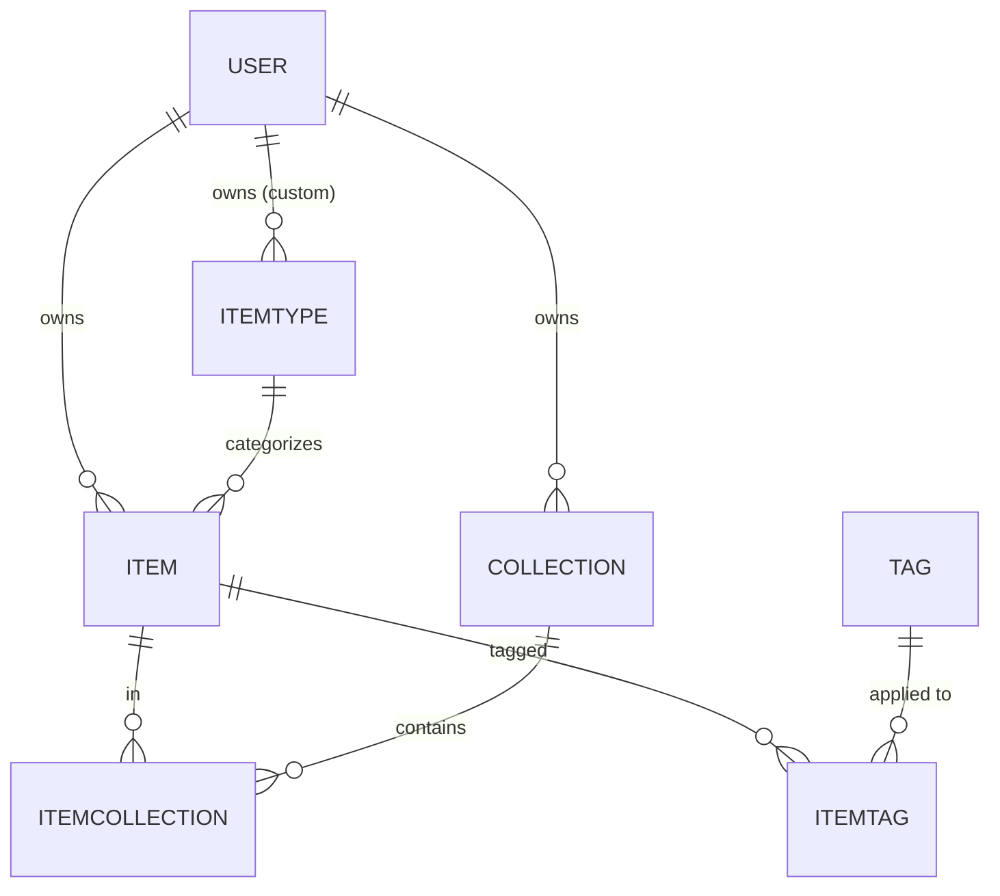
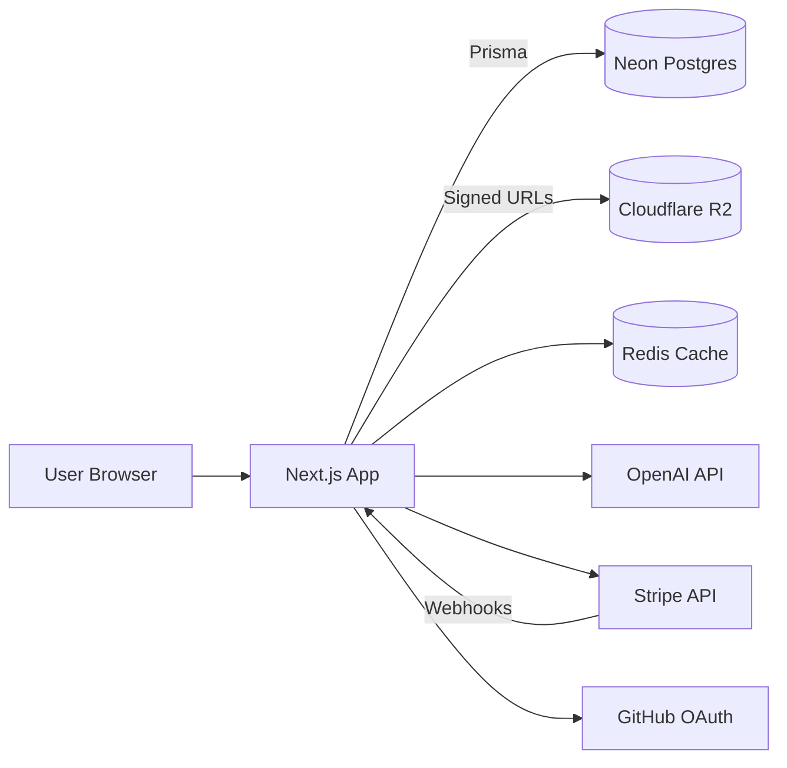

# DevMemory — Project Overview & Roadmap

> One fast, searchable, AI-enhanced hub for every developer's snippets, prompts, commands, notes, files, and links.

---

## 1. The Problem

Developers' essentials live in too many places at once:

- Code snippets in VS Code or Notion
- AI prompts scattered across chat histories
- Context files buried inside random project folders
- Useful links lost in browser bookmarks
- Docs in unsorted folders
- Commands in `.txt` files or shell history
- Project templates in GitHub gists
- One-off shell commands in bash history

The cost: context switching, lost knowledge, and inconsistent workflows. **DevMemory consolidates all of it into a single, fast, searchable hub.**

---

## 2. Target Users

| User | Primary Use |
|---|---|
| Everyday Developer | Grab snippets, prompts, commands, and links quickly |
| AI-first Developer | Save prompts, context files, workflows, system messages |
| Content Creator / Educator | Store code blocks, explanations, course notes |
| Full-stack Builder | Collect patterns, boilerplates, API examples |

---

## 3. Feature Set

### 3.1 Items & Item Types

Every saved piece of knowledge is an **Item**. Each item has a **type** that determines its shape and color.

System types (locked, cannot be modified):

| Type | Content Kind | Icon | Color | Plan |
|---|---|---|---|---|
| Snippet | text | `Code` | `#3b82f6` blue | Free |
| Prompt | text | `Sparkles` | `#8b5cf6` purple | Free |
| Note | text (markdown) | `StickyNote` | `#fde047` yellow | Free |
| Command | text | `Terminal` | `#f97316` orange | Free |
| Link | url | `Link` | `#10b981` emerald | Free |
| File | file (R2 upload) | `File` | `#6b7280` gray | Pro |
| Image | file (R2 upload) | `Image` | `#ec4899` pink | Pro |

Users will eventually be able to create **custom types** (Pro, post-launch). Each type lists at `/items/[typeSlug]` (e.g. `/items/snippets`, `/items/prompts`).

Items should be quick to create and view in a **drawer overlay**, not a full page.

### 3.2 Collections

Curated groupings of items. An item can belong to **multiple collections** (e.g. a React snippet might live in both "React Patterns" and "Interview Prep").

Example collections:

- React Patterns (snippets + notes)
- Context Files (files)
- Python Snippets (snippets)

### 3.3 Search

Powerful search across content, tags, titles, and types.

### 3.4 Authentication

NextAuth v5 with two methods:

- Email + password
- GitHub OAuth

### 3.5 Other Features

- Favorites for collections and items
- Pin items to top
- Recently used
- Import code from file
- Markdown editor for text types
- File upload for file types (Pro)
- Export data (JSON / ZIP)
- Dark mode (default), light mode optional
- Add/remove items to/from multiple collections
- View which collections an item belongs to

### 3.6 AI Features (Pro only)

- AI auto-tag suggestions
- AI summaries
- AI "Explain this code"
- Prompt optimizer

Model: OpenAI `gpt-5-nano`.

---

## 4. Data Models

A few cleanups from the original notes:

- `contentType` needs a `URL` variant (the original had only `text | file`, but links need their own kind).
- `Tag` needs a join table (`ItemTag`) since items have many tags and tags belong to many items.
- `ItemType.userId` is nullable — system types have `null`, custom types are owned by a user.

```prisma
// schema.prisma

generator client {
  provider = "prisma-client-js"
}

datasource db {
  provider = "postgresql"
  url      = env("DATABASE_URL")
}

enum ContentType {
  TEXT
  FILE
  URL
}

model User {
  id            String    @id @default(cuid())
  email         String    @unique
  emailVerified DateTime?
  name          String?
  image         String?

  // Monetization
  isPro                Boolean  @default(false)
  stripeCustomerId     String?  @unique
  stripeSubscriptionId String?  @unique

  // NextAuth relations
  accounts Account[]
  sessions Session[]

  // Domain relations
  items       Item[]
  collections Collection[]
  itemTypes   ItemType[] // custom types

  createdAt DateTime @default(now())
  updatedAt DateTime @updatedAt
}

model ItemType {
  id       String  @id @default(cuid())
  name     String
  slug     String  // used in /items/[slug] routes
  icon     String  // Lucide icon name
  color    String  // hex
  isSystem Boolean @default(false)

  userId String?
  user   User?   @relation(fields: [userId], references: [id], onDelete: Cascade)

  items Item[]

  @@unique([userId, slug])
}

model Item {
  id          String      @id @default(cuid())
  title       String
  contentType ContentType
  content     String?     // text content (null when file)
  fileUrl     String?     // R2 URL (null when text)
  fileName    String?
  fileSize    Int?        // bytes
  url         String?     // for link types
  description String?
  language    String?     // code language hint
  isFavorite  Boolean     @default(false)
  isPinned    Boolean     @default(false)

  userId     String
  user       User     @relation(fields: [userId], references: [id], onDelete: Cascade)
  itemTypeId String
  itemType   ItemType @relation(fields: [itemTypeId], references: [id])

  collections ItemCollection[]
  tags        ItemTag[]

  createdAt DateTime @default(now())
  updatedAt DateTime @updatedAt

  @@index([userId])
  @@index([itemTypeId])
}

model Collection {
  id            String  @id @default(cuid())
  name          String
  description   String?
  isFavorite    Boolean @default(false)
  defaultTypeId String? // type used when creating items inside an empty collection

  userId String
  user   User   @relation(fields: [userId], references: [id], onDelete: Cascade)

  items ItemCollection[]

  createdAt DateTime @default(now())
  updatedAt DateTime @updatedAt

  @@index([userId])
}

model ItemCollection {
  itemId       String
  collectionId String
  addedAt      DateTime @default(now())

  item       Item       @relation(fields: [itemId], references: [id], onDelete: Cascade)
  collection Collection @relation(fields: [collectionId], references: [id], onDelete: Cascade)

  @@id([itemId, collectionId])
  @@index([collectionId])
}

model Tag {
  id    String    @id @default(cuid())
  name  String    @unique
  items ItemTag[]
}

model ItemTag {
  itemId String
  tagId  String

  item Item @relation(fields: [itemId], references: [id], onDelete: Cascade)
  tag  Tag  @relation(fields: [tagId], references: [id], onDelete: Cascade)

  @@id([itemId, tagId])
  @@index([tagId])
}

// NextAuth models (Account, Session, VerificationToken) added per the
// @auth/prisma-adapter requirements — omitted here for brevity.
```

> **Migration rule:** never run `prisma db push` against any environment. All schema changes go through `prisma migrate dev` locally and `prisma migrate deploy` in production.

### Entity Relationships



---

## 5. Tech Stack

| Layer | Choice | Notes |
|---|---|---|
| Framework | Next.js 16 / React 19 | SSR pages, API routes, single repo |
| Language | TypeScript | strict mode |
| Database | Neon Postgres | serverless, branching for previews |
| ORM | Prisma 7 | always fetch latest docs before schema work |
| Auth | NextAuth v5 | email/password + GitHub OAuth |
| File storage | Cloudflare R2 | S3-compatible, signed upload URLs |
| Cache | Redis | optional, for hot collections / search |
| AI | OpenAI `gpt-5-nano` | tagging, summaries, explain, prompt optimizer |
| Styling | Tailwind CSS v4 + ShadCN UI | dark by default |
| Payments | Stripe | subscriptions, webhooks |

### System Architecture



---

## 6. Monetization

Freemium with foundations built in from day one. **During development, all users get every feature** — gating is enforced behind a feature flag and turned on at launch.

| | Free | Pro ($8/mo or $72/yr) |
|---|---|---|
| Items | 50 total | Unlimited |
| Collections | 3 total | Unlimited |
| System types | All except File / Image | All |
| File & Image uploads | — | Yes |
| Custom types | — | Yes (post-launch) |
| Search | Basic | Basic |
| AI auto-tagging | — | Yes |
| AI code explanation | — | Yes |
| AI prompt optimizer | — | Yes |
| Export (JSON / ZIP) | — | Yes |
| Support | Community | Priority |

---

## 7. UI / UX Guidelines

**Aesthetic:** modern, minimal, developer-focused.

- Dark mode default; light mode optional
- Clean typography, generous whitespace
- Subtle borders and shadows
- Syntax highlighting on all code blocks
- Smooth transitions, hover states on cards
- Toast notifications for user actions
- Loading skeletons rather than spinners

**Design References:**

- **Notion** — clean organization
- **Linear** — modern dev aesthetic
- **Raycast** — quick-access patterns

**Layout:**

- Collapsible sidebar + main content
- Sidebar: branded wordmark at top, then **Types** section (Snippets, Prompts, Commands, Notes, Files, Images, Links) each with icon and count, a **Collections / Favorites** group with starred collections, an **All Collections** list, and the signed-in user with a settings affordance pinned to the bottom
- Top bar: global search input with a `⌘K` shortcut hint, plus **New Collection** and **New Item** actions on the right
- Main: a **Dashboard** header ("Your developer knowledge hub"), a **Collections** grid of color-coded cards (background reflects the dominant item type, item count, description, and type-icon row; favorited collections show a star and a `…` overflow menu), followed by a **Pinned** section of item rows showing type icon, title, description, tags, and date
- Individual items open in a quick-access **drawer**, never a separate page. The drawer shows the title with type tags, an action row (Favorite, Pin, Copy, Edit, Delete), Description, syntax-highlighted Content, Tags, the Collections the item belongs to, and Created / Updated details

**Screenshots:**

Use these as a visual base for the dashboard UI — approximate, not pixel-exact. The screenshots show the wordmark **DevStash**; that is outdated — the product is **DevMemory** (**DevMem** for short) everywhere:

- Dashboard / collections grid: [`context/screencapture/dashboard-ui-main.png`](screencapture/dashboard-ui-main.png)
- Item drawer overlay: [`context/screencapture/dashboard-ui-drawer.png`](screencapture/dashboard-ui-drawer.png)

**Responsive:** desktop-first, mobile usable. Sidebar collapses into a drawer on mobile.

---

## 8. Development Roadmap

Six phases, sized to ship something usable early and layer Pro features on top.

### Phase 1 — Foundation

- Next.js 16 + TypeScript + Tailwind v4 + ShadCN setup
- Neon database + Prisma schema + initial migration
- NextAuth v5 (email/password + GitHub)
- Base layout (sidebar + main + drawer shell)
- Dark mode toggle
- Seed script for system `ItemType` rows

### Phase 2 — Core CRUD

- Item create / read / update / delete (text types only: snippet, prompt, note, command, link)
- Collection CRUD
- Add/remove items to/from collections via `ItemCollection`
- Tag CRUD + attach to items
- Item drawer UI with markdown editor + syntax highlighting
- Type routes: `/items/snippets`, `/items/prompts`, etc.

### Phase 3 — Discovery & Polish

- Search across content, tags, titles, types
- Favorites (items + collections)
- Pin items to top
- Recently used
- Import code from file
- Color-coded collection cards (background based on dominant type)
- Loading skeletons, toasts, micro-interactions
- Mobile responsive pass

### Phase 4 — Pro Foundation

- Stripe integration (checkout, customer portal, webhooks)
- `isPro` flag enforcement (feature-flagged off in dev)
- Cloudflare R2 signed upload URLs
- File and Image item types
- Free-tier limits (50 items, 3 collections)
- Export data (JSON / ZIP)

### Phase 5 — AI Features

- OpenAI `gpt-5-nano` integration with usage tracking
- AI auto-tag suggestions on item create/update
- AI summaries for long notes / snippets
- "Explain this code" action on snippets
- Prompt optimizer for prompt items

### Phase 6 — Extensions

- Custom user-defined item types
- Redis caching layer for hot collections and search
- Advanced search (filters, operators)
- Public shareable items / collections (stretch)

### Phase Summary

| Phase | Theme | Gate to next |
|---|---|---|
| 1 | Foundation | App boots, auth works, schema migrated |
| 2 | Core CRUD | Items + collections usable end-to-end |
| 3 | Discovery & Polish | Search + favorites + responsive |
| 4 | Pro Foundation | Payments + uploads + limits live |
| 5 | AI Features | All four AI actions shipping |
| 6 | Extensions | Custom types + caching |

---

## 9. Important Engineering Rules

- **Never** run `prisma db push` or modify the database schema directly. Every change goes through a migration (`prisma migrate dev` locally, `prisma migrate deploy` in prod).
- Always fetch the **latest Prisma 7 docs** before non-trivial schema work — APIs have shifted.
- All file uploads go through **signed R2 URLs**; never proxy file bytes through the Next.js server.
- Stripe webhooks are the source of truth for `isPro` — never set it from the client.
- During development, all Pro features are open to all users behind a single feature flag. Flip at launch.

---

## 10. Open Questions

A few things from the original notes worth deciding before Phase 2:

1. **Search backend** — Postgres full-text to start, or Meilisearch / Typesense from day one?
2. **Markdown editor** — TipTap, Lexical, or a lighter option like `react-markdown` + textarea?
3. **Redis** — wait until there's a real performance need, or wire it in during Phase 1?
4. **Free-tier limits** — soft warnings or hard blocks when a user hits 50 items / 3 collections?
5. **Item versioning** — out of scope for v1, or worth a lightweight history table?
