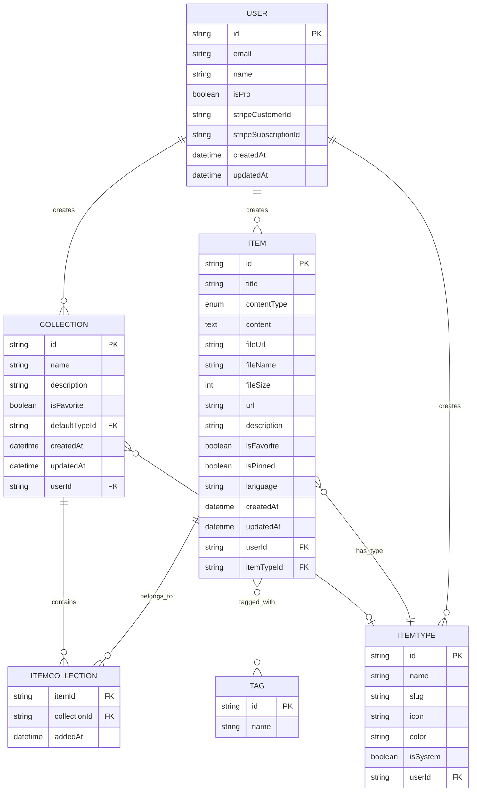
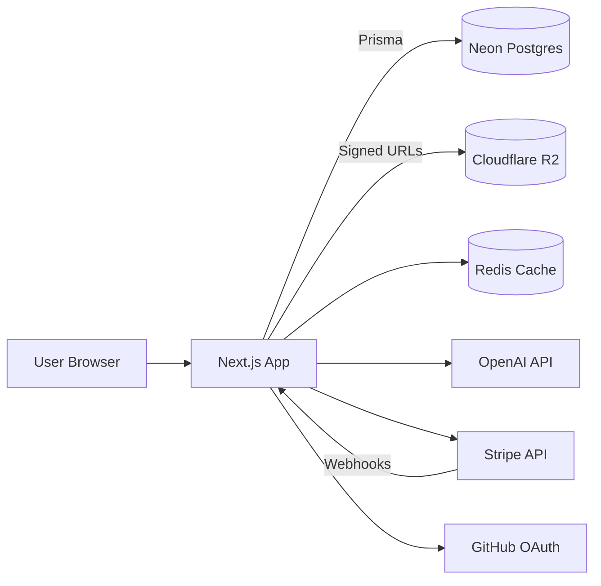

# DevMemory — Project Overview & Roadmap

> One fast, searchable, AI-enhanced hub for every developer's snippets, prompts, commands, notes, files, and links.

---

## 1. The Problem

Developers' essentials live in too many places at once:

- Code snippets in VS Code or Notion
- AI prompts scattered across chat histories
- Context files buried inside random project folders
- Useful links lost in browser bookmarks
- Docs in unsorted folders
- Commands in `.txt` files or shell history
- Project templates in GitHub gists
- One-off shell commands in bash history

The cost: context switching, lost knowledge, and inconsistent workflows. **DevMemory consolidates all of it into a single, fast, searchable hub.**

---

## 2. Target Users

| User | Primary Use |
|---|---|
| Everyday Developer | Grab snippets, prompts, commands, and links quickly |
| AI-first Developer | Save prompts, context files, workflows, system messages |
| Content Creator/Educator | Store code blocks, explanations, course notes |
| Full-stack Builder | Collect patterns, boilerplates, API examples |

---

## 3. Feature Set

### 3.1 Items & Item Types

Every saved piece of knowledge is an **Item**. Each item has a **type** that determines its shape and color.

System types (These cannot be modified):

| Type | Content Kind | Icon | Color | Plan |
|---|---|---|---|---|
| Snippet | text | `Code` | `#3b82f6` blue | Free |
| Prompt | text | `Sparkles` | `#8b5cf6` purple | Free |
| Note | text (markdown) | `StickyNote` | `#fde047` yellow | Free |
| Command | text | `Terminal` | `#f97316` orange | Free |
| Link | url | `Link` | `#10b981` emerald | Free |
| File | file (R2 upload) | `File` | `#6b7280` gray | Pro |
| Image | file (R2 upload) | `Image` | `#ec4899` pink | Pro |

Users will eventually be able to create **custom types** (Pro, post-launch). Each type lists at `/items/[slug]`, where `slug` is a URL-safe key distinct from the display `name` (e.g. `/items/snippets`, `/items/prompts`).

Items should be quick to create and view in a **drawer overlay**, not a full page.

### 3.2 Collections

Curated groupings of items. An item can belong to **multiple collections** (e.g. a React snippet might live in both "React Patterns" and "Interview Prep").

Example collections:

- React Patterns (snippets + notes)
- Context Files (files)
- Python Snippets (snippets)

### 3.3 Search

Powerful search across content, tags, titles, and types.

### 3.4 Authentication

NextAuth v5 with two methods:

- Email + password
- GitHub OAuth

### 3.5 Other Features

- Favorites for collections and items
- Pin items to top
- Recently used
- Import code from file
- Markdown editor for text types
- File upload for file types (Pro)
- Export data (JSON / ZIP)
- Dark mode (default), light mode optional
- Add/remove items to/from multiple collections
- View which collections an item belongs to

### 3.6 AI Features (Pro only)

- AI auto-tag suggestions
- AI summaries
- AI "Explain this code"
- Prompt optimizer

Model: OpenAI `gpt-5-nano`.

---

## 4. Data Models

Notes on the model:

- `contentType` has a `URL` variant (alongside `TEXT` and `FILE`) so links have their own kind.
- `Tag` uses an implicit many-to-many with `Item` via the `"ItemTags"` relation; Prisma manages the join table.
- `ItemType.userId` is nullable — system types have `null`, custom types are owned by a user.
- `ItemType` has a URL-safe `slug` (distinct from the display `name`) used for `/items/[slug]` routes, unique per user via `@@unique([slug, userId])`.
- `User.password` holds the hash for email/password credentials auth (null for OAuth-only users).
- All tables use explicit snake_case names via `@@map`.

### Entity Relationship Diagram



### Prisma Schema

```prisma
// prisma/schema.prisma

generator client {
  provider = "prisma-client-js"
}

datasource db {
  provider = "postgresql"
  url      = env("DATABASE_URL")
}

// ============================================
// USER
// ============================================
model User {
  id                   String       @id @default(cuid())
  email                String       @unique
  emailVerified        DateTime?
  name                 String?
  image                String?
  password             String?
  isPro                Boolean      @default(false)
  stripeCustomerId     String?      @unique
  stripeSubscriptionId String?      @unique
  createdAt            DateTime     @default(now())
  updatedAt            DateTime     @updatedAt

  // Relations
  items       Item[]
  collections Collection[]
  itemTypes   ItemType[]
  accounts    Account[]
  sessions    Session[]

  @@map("users")
}

// ============================================
// NEXTAUTH MODELS
// ============================================
model Account {
  id                String  @id @default(cuid())
  userId            String
  type              String
  provider          String
  providerAccountId String
  refresh_token     String? @db.Text
  access_token      String? @db.Text
  expires_at        Int?
  token_type        String?
  scope             String?
  id_token          String? @db.Text
  session_state     String?

  user User @relation(fields: [userId], references: [id], onDelete: Cascade)

  @@unique([provider, providerAccountId])
  @@map("accounts")
}

model Session {
  id           String   @id @default(cuid())
  sessionToken String   @unique
  userId       String
  expires      DateTime

  user User @relation(fields: [userId], references: [id], onDelete: Cascade)

  @@map("sessions")
}

model VerificationToken {
  identifier String
  token      String   @unique
  expires    DateTime

  @@unique([identifier, token])
  @@map("verification_tokens")
}

// ============================================
// ITEM
// ============================================
enum ContentType {
  TEXT
  FILE
  URL
}

model Item {
  id          String      @id @default(cuid())
  title       String
  contentType ContentType
  content     String?     @db.Text // For TEXT types
  fileUrl     String?     // R2 URL for FILE types
  fileName    String?     // Original filename
  fileSize    Int?        // Size in bytes
  url         String?     // For URL/link types
  description String?     @db.Text
  isFavorite  Boolean     @default(false)
  isPinned    Boolean     @default(false)
  language    String?     // Programming language for syntax highlighting
  createdAt   DateTime    @default(now())
  updatedAt   DateTime    @updatedAt

  // Relations
  userId     String
  user       User     @relation(fields: [userId], references: [id], onDelete: Cascade)
  itemTypeId String
  itemType   ItemType @relation(fields: [itemTypeId], references: [id])
  tags       Tag[]    @relation("ItemTags")

  // Many-to-many with collections
  collections ItemCollection[]

  @@index([userId])
  @@index([itemTypeId])
  @@index([createdAt])
  @@map("items")
}

// ============================================
// ITEM TYPE
// ============================================
model ItemType {
  id       String  @id @default(cuid())
  name     String  // display name, e.g. "My API Stuff"
  slug     String  // URL-safe, used in /items/[slug] routes
  icon     String
  color    String
  isSystem Boolean @default(false)

  // Relations
  userId String?
  user   User?   @relation(fields: [userId], references: [id], onDelete: Cascade)
  items  Item[]

  // Collections that use this as default type
  defaultForCollections Collection[]

  @@unique([slug, userId])
  @@map("item_types")
}

// ============================================
// COLLECTION
// ============================================
model Collection {
  id          String   @id @default(cuid())
  name        String
  description String?  @db.Text
  isFavorite  Boolean  @default(false)
  createdAt   DateTime @default(now())
  updatedAt   DateTime @updatedAt

  // Relations
  userId        String
  user          User      @relation(fields: [userId], references: [id], onDelete: Cascade)
  defaultTypeId String?
  defaultType   ItemType? @relation(fields: [defaultTypeId], references: [id])

  // Many-to-many with items
  items ItemCollection[]

  @@index([userId])
  @@map("collections")
}

// ============================================
// ITEM-COLLECTION JOIN TABLE
// ============================================
model ItemCollection {
  itemId       String
  collectionId String
  addedAt      DateTime @default(now())

  item       Item       @relation(fields: [itemId], references: [id], onDelete: Cascade)
  collection Collection @relation(fields: [collectionId], references: [id], onDelete: Cascade)

  @@id([itemId, collectionId])
  @@map("item_collections")
}

// ============================================
// TAG
// ============================================
model Tag {
  id    String @id @default(cuid())
  name  String @unique
  items Item[] @relation("ItemTags")

  @@map("tags")
}
```

> **Migration rule:** never run `prisma db push` against any environment. All schema changes go through `prisma migrate dev` locally and `prisma migrate deploy` in production.

### Seed Data for System Types

```typescript
// prisma/seed.ts

import { PrismaClient } from '@prisma/client';

const prisma = new PrismaClient();

const systemItemTypes = [
  { name: 'Snippet', slug: 'snippets', icon: 'Code', color: '#3b82f6', isSystem: true },
  { name: 'Prompt', slug: 'prompts', icon: 'Sparkles', color: '#8b5cf6', isSystem: true },
  { name: 'Command', slug: 'commands', icon: 'Terminal', color: '#f97316', isSystem: true },
  { name: 'Note', slug: 'notes', icon: 'StickyNote', color: '#fde047', isSystem: true },
  { name: 'File', slug: 'files', icon: 'File', color: '#6b7280', isSystem: true },
  { name: 'Image', slug: 'images', icon: 'Image', color: '#ec4899', isSystem: true },
  { name: 'Link', slug: 'links', icon: 'Link', color: '#10b981', isSystem: true },
];

async function main() {
  console.log('Seeding system item types...');

  for (const type of systemItemTypes) {
    await prisma.itemType.upsert({
      where: { slug_userId: { slug: type.slug, userId: null } },
      update: {},
      create: type,
    });
  }

  console.log('Seeding complete!');
}

main()
  .catch((e) => {
    console.error(e);
    process.exit(1);
  })
  .finally(async () => {
    await prisma.$disconnect();
  });
```

---

## 5. Tech Stack

| Layer | Choice | Notes |
|---|---|---|
| Framework | Next.js 16 / React 19 | SSR pages, API routes, single repo |
| Language | TypeScript | strict mode |
| Database | Neon Postgres | serverless, branching for previews |
| ORM | Prisma 7 | always fetch latest docs before schema work |
| Auth | NextAuth v5 | email/password + GitHub OAuth |
| File storage | Cloudflare R2 | S3-compatible, signed upload URLs |
| Cache | Redis | optional, for hot collections / search |
| AI | OpenAI `gpt-5-nano` | tagging, summaries, explain, prompt optimizer |
| Styling | Tailwind CSS v4 + ShadCN UI | dark by default |
| Payments | Stripe | subscriptions, webhooks |

### System Architecture



---

## 6. Monetization

Freemium with foundations built in from day one. **During development, all users get every feature** — gating is enforced behind a feature flag and turned on at launch.

| | Free | Pro ($8/mo or $72/yr) |
|---|---|---|
| Items | 50 total | Unlimited |
| Collections | 3 total | Unlimited |
| System types | All except File / Image | All |
| File & Image uploads | — | Yes |
| Custom types | — | Yes (post-launch) |
| Search | Basic | Basic |
| AI auto-tagging | — | Yes |
| AI code explanation | — | Yes |
| AI prompt optimizer | — | Yes |
| Export (JSON / ZIP) | — | Yes |
| Support | Community | Priority |

---

## 7. UI / UX Guidelines

**Aesthetic:** modern, minimal, developer-focused.

- Dark mode default; light mode optional
- Clean typography, generous whitespace
- Subtle borders and shadows
- Syntax highlighting on all code blocks
- Smooth transitions, hover states on cards
- Toast notifications for user actions
- Loading skeletons rather than spinners

**Design References:**

- **Notion** — clean organization
- **Linear** — modern dev aesthetic
- **Raycast** — quick-access patterns

**Layout:**

- Collapsible sidebar + main content
- Sidebar: branded wordmark at top, then **Types** section (Snippets, Prompts, Commands, Notes, Files, Images, Links) each with icon and count, a **Collections / Favorites** group with starred collections, an **All Collections** list, and the signed-in user with a settings affordance pinned to the bottom
- Top bar: global search input with a `⌘K` shortcut hint, plus **New Collection** and **New Item** actions on the right
- Main: a **Dashboard** header ("Your developer knowledge hub"), a **Collections** grid of color-coded cards (background reflects the dominant item type, item count, description, and type-icon row; favorited collections show a star and a `…` overflow menu), followed by a **Pinned** section of item rows showing type icon, title, description, tags, and date
- Individual items open in a quick-access **drawer**, never a separate page. The drawer shows the title with type tags, an action row (Favorite, Pin, Copy, Edit, Delete), Description, syntax-highlighted Content, Tags, the Collections the item belongs to, and Created / Updated details

**Screenshots:**

Use these as a visual base for the dashboard UI — approximate, not pixel-exact. The screenshots show the wordmark **DevStash**; that is outdated — the product is **DevMemory** (**DevMem** for short) everywhere:

- Dashboard / collections grid: [`context/screencaptures/dashboard-ui-main.png`](screencaptures/dashboard-ui-main.png)
- Item drawer overlay: [`context/screencaptures/dashboard-ui-drawer.png`](screencaptures/dashboard-ui-drawer.png)

**Responsive:** desktop-first, mobile usable. Sidebar collapses into a drawer on mobile.

---

## 8. Development Roadmap

An ordered checklist, sized to ship something usable early and layer Pro features on top.

1. [ ] Initialize Next.js 16 project with TypeScript
2. [ ] Set up Prisma with Neon PostgreSQL
3. [ ] Configure NextAuth v5 (email + GitHub)
4. [ ] Create database migrations for initial schema
5. [ ] Seed system item types
6. [ ] Build core UI components with shadcn/ui
7. [ ] Implement items CRUD
8. [ ] Implement collections CRUD
9. [ ] Add search functionality
10. [ ] Set up Cloudflare R2 for file uploads
11. [ ] Integrate Stripe for subscriptions
12. [ ] Add AI features (OpenAI `gpt-5-nano` integration)
13. [ ] Implement usage limits for free tier
14. [ ] Testing & polish
15. [ ] Deploy to production

---

## 9. Important Engineering Rules

- **Never** run `prisma db push` or modify the database schema directly. Every change goes through a migration (`prisma migrate dev` locally, `prisma migrate deploy` in prod).
- Always fetch the **latest Prisma 7 docs** before non-trivial schema work — APIs have shifted.
- All file uploads go through **signed R2 URLs**; never proxy file bytes through the Next.js server.
- Stripe webhooks are the source of truth for `isPro` — never set it from the client.
- During development, all Pro features are open to all users behind a single feature flag. Flip at launch.

---

## 10. Open Questions

A few things from the original notes worth deciding before core CRUD work (checklist steps 7–9):

1. **Search backend** — Postgres full-text to start, or Meilisearch / Typesense from day one?
2. **Markdown editor** — TipTap, Lexical, or a lighter option like `react-markdown` + textarea?
3. **Redis** — wait until there's a real performance need, or wire it in during initial setup?
4. **Free-tier limits** — soft warnings or hard blocks when a user hits 50 items / 3 collections?
5. **Item versioning** — out of scope for v1, or worth a lightweight history table?
